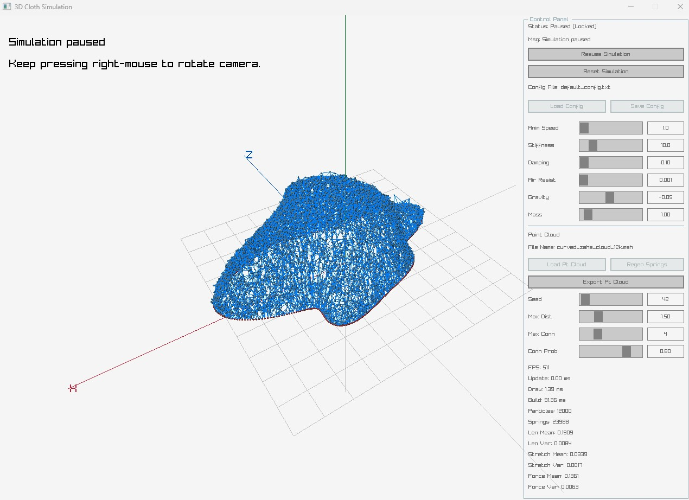
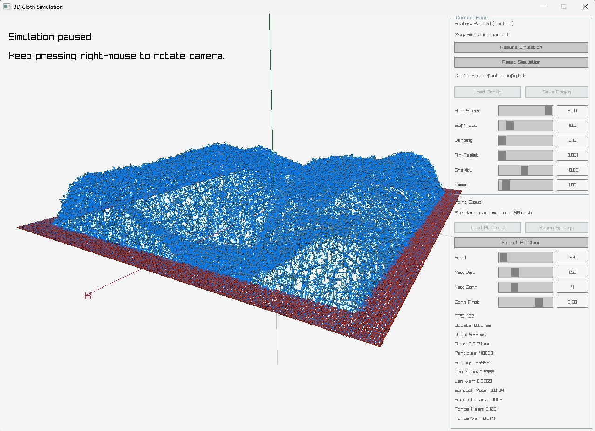

# Mesh3D

## Screenshots / 截图

Curved boundary cloud / 曲线边界点云：



[Watch curved boundary demo video / 查看曲线边界演示视频](./docs/crv_v_01.mp4)

[](./docs/crv_v_01.mp4)

Dense square cloud / 高密度方形点云：



## 中文

Mesh3D 是一个基于 raylib 的 3D 质点-弹簧网格模拟项目。它可以生成规则布料网格，也可以加载 `.msh` 点云文件，构建不规则边界和曲面点阵，用于观察弹簧连接、重力、阻尼和空气阻力下的形变效果。

### 目录

- `win_cuda/`：Windows 桌面端模拟器，使用 raylib 渲染，支持 CUDA/CPU 构建。
- `win_wasm/`：WebAssembly 相关版本。
- `py_scripts/`：点云生成脚本，例如随机点云和曲线边界点云。
- `rhino_py_scripts/`：Rhino 与 `.msh` 点云互转脚本。
- `docs/`：图片和补充资料。

### 构建运行

```bash
cd win_cuda
build.bat
```

更详细的桌面端说明见 [`win_cuda/README.md`](./win_cuda/README.md)。

### 点云生成

曲线边界点云：

```bash
python py_scripts/generate_curved_cloud.py --preset 12k
python py_scripts/generate_curved_cloud.py --preset 48k
```

也可以手动控制点数：

```bash
python py_scripts/generate_curved_cloud.py --boundary 768 --interior 47232
```

总点数为：

```text
boundary + interior
```

### `.msh` 格式

每一行表示一个质点：

```text
x y z fixed mass
```

- `x y z`：三维坐标。
- `fixed`：`1` 表示固定边界点，`0` 表示自由内部点。
- `mass`：质点质量。

### 原理简述

模拟器把每个点看作质点，点与点之间自动生成弹簧。弹簧根据胡克定律提供恢复力，阻尼和空气阻力负责消耗能量，让振动逐渐衰减。固定点用于约束边界，自由点在力的作用下运动。

## English

Mesh3D is a raylib-based 3D mass-spring mesh simulation project. It can generate a regular cloth grid or load `.msh` point clouds to build irregular boundaries and curved particle layouts for testing deformation under springs, gravity, damping, and air resistance.

### Structure

- `win_cuda/`: Windows desktop simulator with raylib rendering and CUDA/CPU build support.
- `win_wasm/`: WebAssembly-related version.
- `py_scripts/`: Point-cloud generators, including random and curved-boundary clouds.
- `rhino_py_scripts/`: Rhino import/export helpers for `.msh` point clouds.
- `docs/`: Images and supporting material.

### Build And Run

```bash
cd win_cuda
build.bat
```

See [`win_cuda/README.md`](./win_cuda/README.md) for detailed desktop instructions.

### Generate Point Clouds

Curved-boundary point clouds:

```bash
python py_scripts/generate_curved_cloud.py --preset 12k
python py_scripts/generate_curved_cloud.py --preset 48k
```

Manual point counts:

```bash
python py_scripts/generate_curved_cloud.py --boundary 768 --interior 47232
```

Total point count:

```text
boundary + interior
```

### `.msh` Format

Each non-comment line defines one particle:

```text
x y z fixed mass
```

- `x y z`: 3D position.
- `fixed`: `1` for pinned boundary particles, `0` for free interior particles.
- `mass`: particle mass.

### Physics Summary

The simulator treats every point as a particle and automatically creates springs between nearby particles. Springs provide restoring force through Hooke's law, while damping and air resistance dissipate energy so motion settles over time. Fixed particles constrain the boundary, and free particles move under the applied forces.
