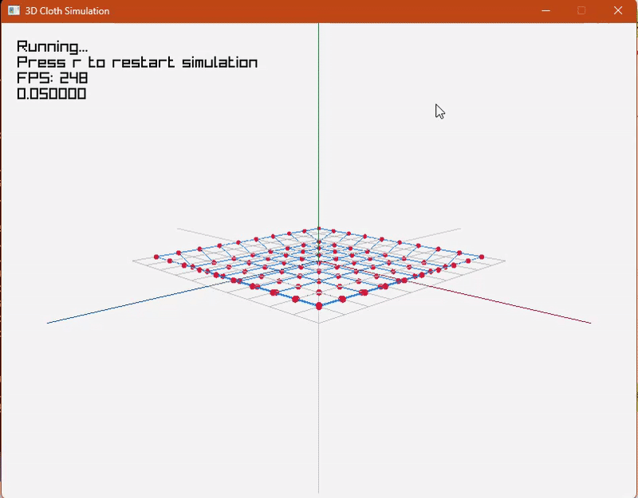
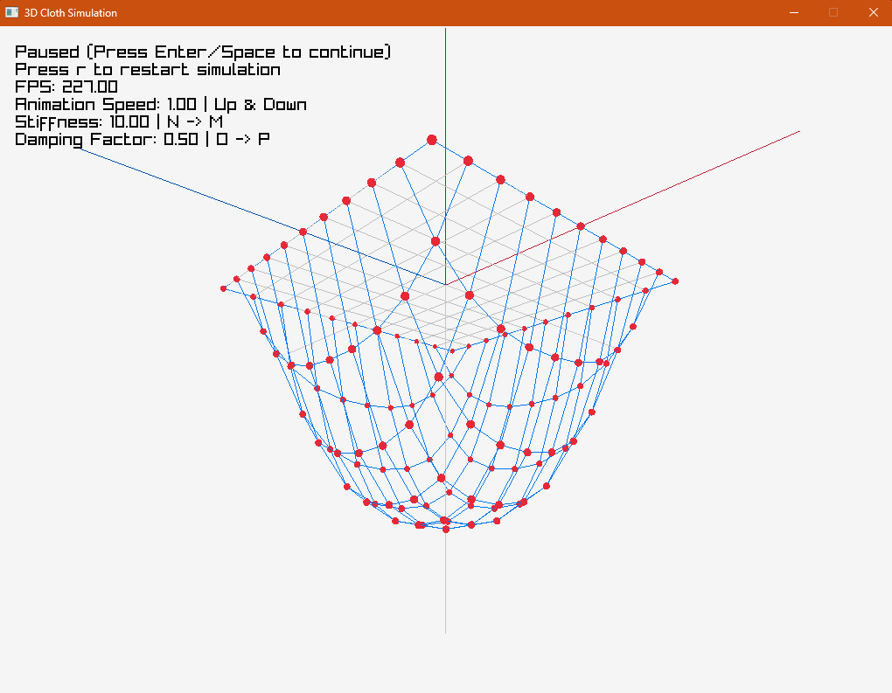

# Mesh3D





A simple project using raylib to simulate a 3D mesh.

## Features

- Adjustable mesh sizes
- Adjustable stiffness
- Adjustable damping factor
- Adjustable animation speed
- Adjustable camera position

## Physics Principles

This project is a cloth simulation based on the **Mass-Spring System**. Each grid intersection is a **Particle**, and particles are connected by **Springs**. The core physics comes from the combination of two forces: elastic restoring force and damping force.

### Hooke's Law and Stiffness

**Stiffness** corresponds to the spring constant **k** in Hooke's Law:

```
F_spring = -k · Δx
```

Where:
- **k** is the `stiffness` value in this project.
- **Δx** is the difference between the spring's current length and its rest length (deformation).

**Intuition:**
- **Higher k**: The spring is "stiffer." The same amount of stretch or compression produces a larger restoring force. The cloth behaves more taut and resists deformation (like canvas or a tightly stretched rubber band).
- **Lower k**: The spring is "softer." The cloth stretches and sags more easily, feeling more elastic (like a loose silk scarf or an elastic bandage).

> In the code, `stiffness` is passed directly as Hooke's Law's `k` into `Spring::ApplySpringForce()`, determining how sensitive each spring is to deformation.

### Damping (Dampness)

Damping is **not** part of Hooke's Law. It is an additional dissipative force proportional to **velocity**:

```
F_damping = -c · v
```

Where:
- **c** is the `dampingFactor` in this project.
- **v** is the relative velocity of the two particles along the spring's direction.

**Intuition:**
- Damping simulates "resistance" or "energy dissipation" — it does not make the cloth harder or softer, but causes oscillations and vibrations to **decay over time**.
- **Higher c**: Energy dissipates faster. After a disturbance (e.g., dragging and releasing with the mouse), the cloth quickly settles down, like fabric underwater.
- **Lower c**: Energy dissipates slower. The cloth will oscillate and swing for a long time, like silk in a vacuum or smooth airflow.
- **c = 0**: Almost no energy loss. The cloth would oscillate forever (ideal case).

### Relationship Between Stiffness and Damping

| Parameter | Physical Quantity | Affected Phenomenon |
|-----------|-------------------|---------------------|
| **Stiffness (k)** | Spring constant in Hooke's Law | Cloth **hardness** and **resistance to deformation** |
| **Damping (c)** | Damping coefficient | Cloth oscillation **decay rate** and **settling time** |

**Analogy**: Imagine a piece of cloth hanging on a clothesline —
- **Stiffness** determines whether the cloth is stiff like thick canvas (high k) or soft and saggy like gauze (low k).
- **Damping** determines whether, after you flick the cloth, it stops quickly like it's in water (high c), or keeps fluttering for a long time like it's in the wind (low c).

They are independently adjustable: you can make the cloth both stiff and oscillating (high k, low c), or soft but quickly stable (low k, high c).

## Controls

### Keyboard
- `mouse` to control the camera to rotate, to zoom in/out
- `r` to restart the simulation
- `space`/`enter` to pause the simulation
- `up`/`down` to increase/decrease the animation speed
- `n`/`m` to increase/decrease the stiffness
- `d`/`f` to increase/decrease the damping factor

### GUI Panel (Right Side)
A control panel on the right side provides buttons and sliders for all actions:
- **Play / Pause** — toggle simulation state
- **Restart** — reset the cloth mesh
- **Camera: Free / Locked** — enable or disable mouse camera control
- **Save Config** — write current settings to `config.txt`
- **Export Pt Cloud** — save the current particle positions as `.msh` point cloud data
- **Anim Speed** — slider to adjust animation speed (0.05 ~ 3.0)
- **Stiffness** — slider to adjust stiffness (1.0 ~ 50.0), **disabled while simulation is running**
- **Damping** — slider to adjust damping factor (0.0 ~ 5.0)
- **Air Resist** — slider to adjust air resistance (0.0 ~ 0.1)

> **Tip:** Mouse over the right panel automatically disables camera rotation so you can interact with the controls safely.

## Point Cloud (Irregular Mesh)

By default, the app generates a regular rectangular grid. You can also load a custom **point cloud file** to create an irregular mesh of any shape.

### Point Cloud File Format

Create a plain text file (e.g., `mycloud.msh`). Each line defines one particle:

```
# comments start with #
x y z fixed mass
```

- `x y z`: particle position in 3D space.
- `fixed`: `1` = pinned (does not move), `0` = free.
- `mass`: particle mass (float, must be > 0).

See [`example_cloud.msh`](./example_cloud.msh) for a working example.

### How Springs Are Generated

The app does **not** require explicit spring definitions. Instead, springs are generated automatically using a **seeded random algorithm**:

1. For every pair of particles within `maxSpringDist`, a candidate spring is created.
2. Candidates are shuffled using the `springSeed`.
3. Each candidate pair has a `springConnectProb` chance of becoming a real spring.
4. No particle gets more than `maxSpringsPerParticle` springs.

This means **the same seed always produces the same mesh topology** — perfect for reproducible experiments.

### GUI Controls (Point Cloud Section)

- **File** — type the path to your point cloud file.
- **Apply Cloud File** — load the file and rebuild the mesh.
- **Export Pt Cloud** — save the current mesh particle state in `.msh` format.
- **Seed** — random seed for spring generation (0 ~ 999).
- **Max Dist** — maximum distance between particles to consider a spring (0.1 ~ 5.0).
- **Max Conn** — maximum springs per particle (1 ~ 12).
- **Conn Prob** — probability that a candidate pair becomes a spring (0.0 ~ 1.0).

### Config File Keys

| Key | Default | Description |
|-----|---------|-------------|
| `pointCloudFile` | `""` | Path to point cloud file. Empty = use regular grid. |
| `springSeed` | `42` | Random seed for reproducible spring generation. |
| `maxSpringDist` | `1.5` | Max distance for spring candidates. |
| `maxSpringsPerParticle` | `4` | Max springs attached to one particle. |
| `springConnectProb` | `0.8` | Probability of connecting a candidate pair. |

## Download exe file

[Download](./download/Mesh3D.exe)

## Build from source

1. Clone the repository
2. Run `build.bat` to build the project

## Build WASM

1. Clone the repository
2. Run `build_wasm.bat` to build the project for WebAssembly (WASM)
3. Open `index.html` in a web browser to run the simulation in WASM
4. You can custom the style by adding this line into `index.html`:

```html
    <link href="./my-style.css" rel="stylesheet" />
```
